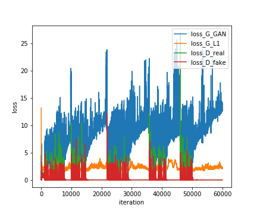
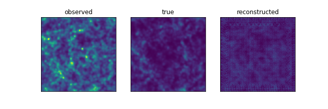

# conditional GAN

cGAN model based on pix2pix [(Isola et al. 2016)](https://github.com/eriklindernoren/PyTorch-GAN)

## Requirement

- Python 3.8+

Install the following libraries with `pip`.
- torch==1.12.0
- torchvision==0.13.0
- torchinfo
- tqdm
- astropy

## How to Run

Specify the desired model using the `--model` flag when running the program. There are two available models:

- **pix2pix**: for 2D images

- **vox2vox**: for 3D cubes

You can set mutliple input_id and/or output_id.


### Example Usage

- **Training**
```
python main.py --isTrain --model pix2pix --input_id comb --output_id ha oiii
```

- **Test**
```
python main.py --model pix2pix --input_id comb --output_id ha oiii
```

Instead of manually specifying parameters with the commands mentioned above, you can execute the script `run.sh` as follows: 
```
./run.sh
```


Use plot.ipynb to check the model performance. 

- Loss function:  
 

- Test output:  
 

- Images generated during training:  


## References


## Known Issues

- RuntimeError: cuDNN error: CUDNN_STATUS_INTERNAL_ERROR

- Network outputs nan or inf values

These errors were due to very large/small values in some of the discriminator's output patches. One can avoid this by decreasing the number of patches in the output. A simple way is to increase the number of layers.
 

