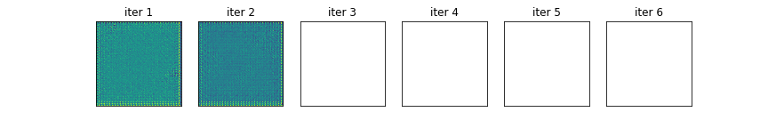

# conditional GAN

cGAN model based on pix2pix [(Isola et al. 2016)](https://github.com/eriklindernoren/PyTorch-GAN)

## Requirement

- Python 3.8+

Install the following libraries with `pip`.
- torch==1.12.0
- torchvision==0.13.0
- tqdm
- astropy

## How to Run

Training
```
python main.py --isTrain 
```

Test
```
python main.py
```

Run both training and test code by 
```
./run.sh
```
You can change the parameters in run.sh.


Use plot.ipynb to check the model performance. 

Loss function:  
 

Test output:  
 

Images generated during training:  


You can check the model structure in the output file at `./tmp`


- Input shape: (batch_size, input_nc, input_dim, input_dim)

- Output shape: (batch_size, output_nc, output_dim, output_dim)


## References


## Known Issues

- An error CUDNN_STATUS_EXECUTION_FAILED:
solved when I re-launch the console.


