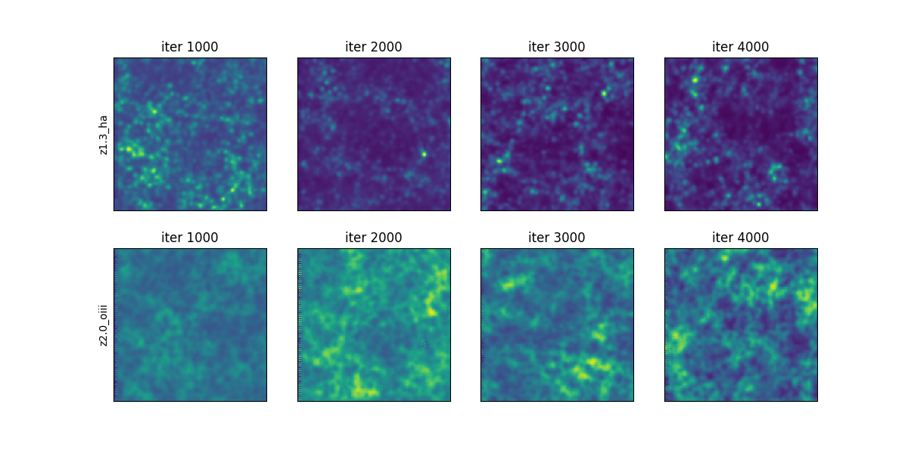

# conditional GAN

cGAN model based on pix2pix [(Isola et al. 2016)](https://github.com/eriklindernoren/PyTorch-GAN)

## Requirement

- Python 3.8+

Install the following libraries with `pip`.
- torch==1.12.0
- torchvision==0.13.0
- torchinfo
- tqdm
- astropy

## How to Run

Specify the desired model using the `--model` flag when running the program. There are two available models:

- **pix2pix**: Model for 2D images. Input/output data size is (batch, nc, input_dim, input_dim)

- **vox2vox**: Model for 3D cubes. Input/output data size is (batch, nc, input_dim, input_dim, input_dim)

You can set mutliple sources and/or targets.


### Example Usage

- **Training**
```
python main.py --isTrain --output_dir ./output/train1 --data_dir ./training_data --model pix2pix --source_id total_map --target_id ha oiii --ndata 300 --nindex 100 --norm 2.0e-7
```
This reads images from `./training_data/run{i}_index{j}_ha.fits` and `./training_data/run{i}_index_{j}_oiii.fits` as target data, where `i`(`j`) runs from 0 to 300 (100). Setting `--source_id total_map` means the sum of the target data will be used as an input to the machine. The data will be normalized by 2.0e-7. The outputs will be stored in `./output/train1`.

- **Test**
```
python main.py --output_dir ./output/train1 --data_dir ./test_data --model pix2pix --load_iter -1 --source_id total_map --target_id ha oiii --ndata 100 --nindex 1 --norm 2.0e-7
```
This reads images from `./test_data/run{i}_index{j}_ha.fits` and `./test_data/run{i}_index{j}_oiii.fits`. The model is restored from `./output/train1/checkpoints`. The option `--load_iter -1` means that it load the model from the last checkpoints.

- **Run all**
Instead of manually specifying parameters with the commands mentioned above, you can execute the script `run.sh` as follows: 
```
./run.sh
```

- **Plot results**
Use plot.ipynb to check the model performance. 

- Loss function:  
 

- Test output:  
 

- Images generated during training:  



## References


## Known Issues

- Actually you do not need to set the `input_dim` parameter. This is used for `torchinfo.summary` only.

- RuntimeError: cuDNN error: CUDNN_STATUS_INTERNAL_ERROR

- Network outputs nan or inf values

These errors were due to very large/small values in some of the discriminator's output patches. One can avoid this by decreasing the number of patches in the output. A simple way is to increase the number of layers.
 

