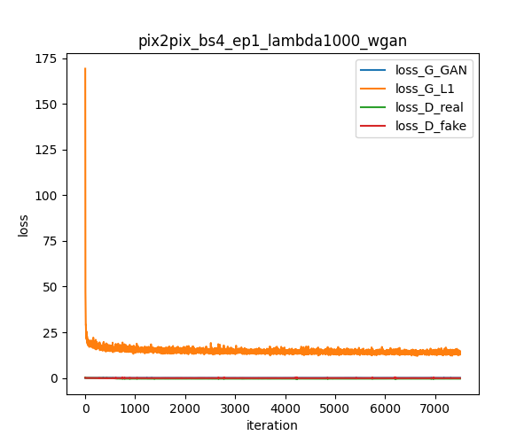

# conditional GAN

cGAN model based on pix2pix [(Isola et al. 2016)](https://github.com/eriklindernoren/PyTorch-GAN)

## Requirement

- Python 3.8+

Install the following libraries with `pip`.
- torch==1.12.0
- torchvision==0.13.0
- torchinfo
- tqdm
- astropy

## How to Run

Run training and testing can be run using 
```
./run.sh
```
The implementation in this branch allows training ~~`gan_mode=vanilla`~~, ~~`gan_mode=wgan`~~, and `gan_mode=wgangp`. 

Use `plot.ipynb` to check the model performance. More scripts for checking the model performance can be found in branch #4. 

- Loss function:  
 

- Test output:  
 

- Images generated during training:  


You can check the model structure in the output file 


- Input shape: (batch_size, input_nc, input_dim, input_dim)

- Output shape: (batch_size, output_nc, output_dim, output_dim)


## References


## Known Issues

- RuntimeError: cuDNN error: CUDNN_STATUS_INTERNAL_ERROR

- Network outputs nan or inf values

These errors were due to very large/small values in some of the discriminator's output patches. To avoid this, one should decrease the number of patches in the output. One simple way is to increase the number of layers.
 

